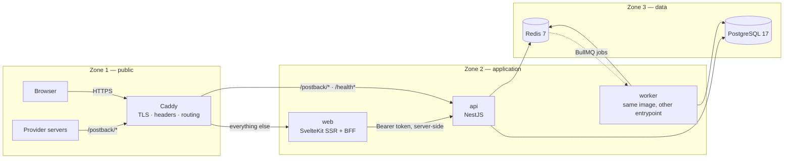
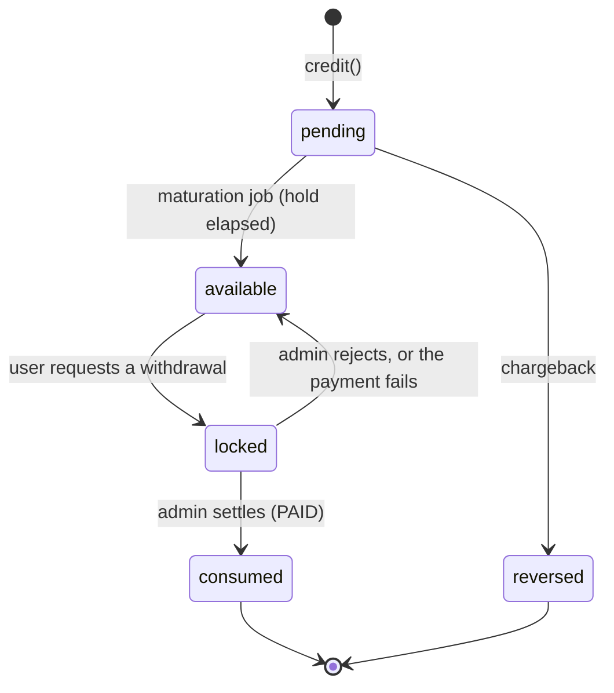

# GemOne

An **offerwall aggregation platform**. Users complete offers (surveys, installs,
sign-ups) sourced from third-party offerwall networks, earn points for
completions the provider confirms by signed postback, and withdraw those points
as cash-equivalent rewards.

It owns no ad inventory. What it owns is the reward ledger between a provider's
postback and a user's withdrawal — which is why most of this codebase is about
accounting correctness, provider independence, and the audit trail behind an
administrative decision.

| | |
|---|---|
| **Stack** | NestJS 11 · SvelteKit 2 (Svelte 5) · PostgreSQL 17 · Redis 7 · BullMQ · Caddy 2 |
| **Runtime** | Node 24 · pnpm 11 |
| **Repo** | pnpm workspace monorepo — 2 apps, 2 packages |
| **Status** | Feature-complete MVP against a **mock** provider. Not production-deployed. |

---

## Table of contents

- [Project status](#project-status)
- [Quick start](#quick-start)
- [Architecture](#architecture)
- [Repository layout](#repository-layout)
- [Core domain flows](#core-domain-flows)
- [Architectural invariants](#architectural-invariants)
- [Local development](#local-development)
- [Environment variables](#environment-variables)
- [Testing](#testing)
- [Commands reference](#commands-reference)
- [Production](#production)
- [Troubleshooting](#troubleshooting)
- [Limitations and deferred work](#limitations-and-deferred-work)
- [Security notes](#security-notes)
- [Documentation map](#documentation-map)

---

## Project status

### Implemented

Every item below exists on `main`, with tests.

| Area | What is there |
|---|---|
| **Auth** | Email/password registration, login, email verification, password reset, refresh-token rotation with reuse detection, per-account and per-IP login throttling |
| **Offer catalog** | Provider registration, catalog sync jobs, the offer wall, offer detail |
| **Clicks** | Signed, opaque `sub_id` handed to the provider; per-IP click limits |
| **Postbacks** | Public `GET`/`POST /postback/:slug`, signature verification, IP allowlist, durable archive, asynchronous processing |
| **Conversions** | Matched to a click, priced, deduplicated, reversible (chargebacks) |
| **Reward accounting** | Three-bucket balances, an append-only transaction history, hold periods, maturation job, reconciliation job |
| **Fraud** | Seven rules producing a score; conversions held rather than refused; admin clear/confirm |
| **Payouts** | Request → review → approve → settle/fail/reject, with points locked at request time |
| **Configuration** | 37 database-backed keys, global and per-provider, audited, hot-reloaded across processes, with optimistic-concurrency writes |
| **Admin** | Users (standing, role, balance), payout queue, fraud queue, providers, settings — all audited |
| **Web** | SSR SvelteKit app + BFF: landing, auth, dashboard, wall, offer detail, earnings statement, withdrawals, and the admin screens |
| **Ops** | Health/readiness endpoints, structured JSON logs, production compose, encrypted off-host backups, restore and drill scripts |

### Required before a real production deployment

These are **not** built and are not defects — they are the deliberate edge of
the MVP.

1. **A real offerwall provider.** The only adapter in the tree is `mock`, which
   talks to no network. See [Adding a provider](#adding-a-provider).
2. **A real payout provider.** `ManualPayoutProvider` is the only implementation:
   an admin approves a request, sends the money by hand, and records the external
   reference. Nothing calls PayPal, Stripe, or a bank.
3. **SMTP.** Without `SMTP_HOST` the API refuses to boot in production, because
   the fallback writes password-reset links into the log.
4. **A host, a domain, TLS, and the deploy itself.** No VPS is provisioned and no
   registry is configured; CI publishes images to GHCR on `main`, and nothing
   consumes them yet.

### Deliberately not implemented

TOTP for admins (the architecture accommodates it — §8.4), publisher/embed
support, feature flags, microservices, event sourcing, i18n beyond a stored
locale, and a real-time offer-recommendation engine. Each is listed with its
trigger in [ARCHITECTURE.md §22](docs/ARCHITECTURE.md) and
[TODO.md](docs/TODO.md).

### Known technical debt

Tracked as numbered entries in [docs/TODO.md](docs/TODO.md), each with the
concrete event that would make it worth doing. The ones worth knowing before you
read code:

- **T89** — the status endpoint has no last-administrator interlock (the role
  endpoint does). Two admins suspending each other concurrently can lock the
  platform out; recovery is direct SQL.
- **T6** — integration tests reset tables instead of rolling back a transaction,
  so the suite runs one file at a time.
- **T12** — the wall does not deduplicate or rank across providers yet. With one
  provider there is nothing to deduplicate.
- **T21** — postbacks are archived but cannot yet be replayed from the archive.
- **T70** — the withdrawal form's method list is hardcoded in `web` while the
  methods themselves are configuration.

---

## Quick start

Prerequisites: **Docker** (with Compose v2), **Node 24**, **pnpm 11**
(`corepack enable` is enough — the version is pinned in `package.json`).

```sh
git clone <this repo> && cd gemone
pnpm install

# `@gemone/contracts` is a build artifact and is not committed. There is no
# postinstall hook, so a fresh clone builds it once — otherwise every file that
# imports a shared type fails to compile.
pnpm --filter @gemone/contracts build

# 1. Infrastructure. Postgres on 5432, Redis on 6379.
docker compose up -d postgres redis

# 2. Local configuration for the API workspace and the Prisma CLI.
cp apps/api/.env.example apps/api/.env

# 3. Schema.
pnpm --filter @gemone/api db:deploy

# 4. The whole stack, built and running behind Caddy.
docker compose up -d --build
```

The app is then at **<http://localhost:8080>** (Caddy). The API is also
published directly on `:3000` and `web` on `:5173` for development.

Create the first administrator — there is no admin self-registration:

```sh
docker compose exec api node apps/api/dist/scripts/create-admin.js you@example.com 'a-strong-password'
```

Then sign in at <http://localhost:8080/login>. The admin screens start at
`/admin/users` — there is no `/admin` index page. To get offers on the wall,
register the `mock` provider at `/admin/providers`, enable it, and run a catalog
sync.

> Email is not delivered locally. With `SMTP_HOST` unset, verification and
> password-reset links are written to the API log:
> `docker compose logs -f api`.

---

## Architecture

Three trust zones behind one edge. The browser never talks to the API.



**Why `web` proxies the API** ([§6.1](docs/ARCHITECTURE.md)): the access token
never reaches the browser. `web` holds an httpOnly `gemone_session` cookie,
attaches the bearer token server-side, and the API needs no CORS configuration
because no browser ever calls it cross-origin. Admin endpoints are reachable
through one generic `/api/admin/[...path]` proxy in `web`, which builds the
target path itself and never takes it from the caller.

**`api` and `worker` are one image with two entrypoints** — `dist/main.js` and
`dist/worker.js`. They share code and configuration and differ only in what they
run.

### Backend

NestJS 11 on Express, TypeScript, Prisma 7 against PostgreSQL 17 through the
`pg` driver adapter, BullMQ on Redis 7, `class-validator` DTOs, Zod for
environment validation, argon2 for password hashing, Pino for logs.

Domain modules under `apps/api/src/modules/`: `auth`, `users`, `providers`,
`offers`, `clicks`, `conversions`, `rewards`, `payouts`, `fraud`,
`notifications`, `admin`. Cross-cutting infrastructure under
`apps/api/src/core/`: `config`, `database`, `errors`, `events`, `health`,
`logging`, `queue`, `security`, `time`.

### Frontend

SvelteKit 2 with Svelte 5 runes and `adapter-node`, Tailwind CSS v4, Lucide
icons. Server-side data loading only — no client-side data fetching library, and
no store of API data in the browser. Forms are progressively enhanced SvelteKit
form actions, so every mutation works without JavaScript.

The shared UI kit lives in `apps/web/src/lib/components/ui/` and is documented in
[docs/UI_KIT.md](docs/UI_KIT.md). `/dev/ui` renders every component in every
state; it returns 404 in a production build.

### Database

PostgreSQL 17, 16 models, 14 migrations, snake_case tables, UUIDv7 primary keys.
Money is stored as integer minor units and points as integers — never floats.
Schema: `apps/api/prisma/schema.prisma`. Rationale, indexes and retention:
[docs/DATABASE.md](docs/DATABASE.md).

### Redis

Three distinct uses, deliberately not one abstraction:

1. **BullMQ queues** — the only durable use.
2. **Counters** — login throttling, public-endpoint throttling, click limits.
   These fail *closed*.
3. **Pub/sub cache invalidation** — one channel, `ow:1:invalidation`, so a
   configuration change in one process reaches the others.

Redis holds nothing that cannot be reconstructed; development runs it with
persistence off.

### Queues and workers

Five queues, separated by failure characteristics rather than by volume
([§13.1](docs/ARCHITECTURE.md)):

| Queue | Work | Why separate |
|---|---|---|
| `postbacks` | Process an archived postback into a conversion | Latency-sensitive, highest volume, must never queue behind anything |
| `rewards` | Reward maturation | Takes balance row locks; benefits from serialization |
| `catalog` | Provider catalog sync | Slow outbound HTTP, low concurrency so providers are not hammered |
| `maintenance` | Nightly reconciliation | Scans; serialized at concurrency 1 |
| `notifications` | Outbound email | Slow, external, allowed to be late |

**The worker is not optional.** Without it, postbacks are archived but never
processed, points never mature from `pending` to `available`, and catalog syncs
never run. `docker compose up -d` starts it; running the API alone does not.

Every job is idempotent and re-runnable, carries identifiers rather than entity
snapshots, and is bounded ([§12.2](docs/ARCHITECTURE.md)).

---

## Repository layout

```
gemone/
├── apps/
│   ├── api/                  NestJS — API + worker (one image, two entrypoints)
│   │   ├── prisma/           schema.prisma + migrations
│   │   ├── src/core/         config, database, errors, events, health, logging,
│   │   │                     queue, security, time
│   │   ├── src/modules/      the eleven domain modules
│   │   ├── src/jobs/         BullMQ processors (worker only)
│   │   ├── src/scripts/      create-admin
│   │   └── test/integration/ integration suite (real Postgres + Redis)
│   └── web/                  SvelteKit — SSR UI + BFF proxy
│       └── src/lib/          components/ (ui, shell, admin, …) + domain vocabularies
├── packages/
│   ├── contracts/            shared request/response types, enums, error codes
│   └── tsconfig/             shared TypeScript base configs
├── docker/                   Caddyfile, Dockerfiles, backup/restore scripts
├── docs/                     PROJECT, ARCHITECTURE, DATABASE, RUNBOOK,
│                             DECISIONS, TODO, DESIGN_SYSTEM, UI_KIT, UI_AUDIT
├── docker-compose.yml        local development
├── docker-compose.prod.yml   production (images only, nothing builds)
└── .github/workflows/ci.yml
```

### Packages

**`@gemone/contracts`** is the shared vocabulary between `api` and `web`: request
and response shapes, enums, error codes, and pure derivation rules that both
sides must agree on (for example the reward-status rules the API filters by and
the web renders). It contains **no runtime dependencies and no business logic**.

It is compiled to both CommonJS and ESM, because NestJS consumes CJS and Vite
consumes ESM. It is a build artifact and is not committed, and **there is no
postinstall hook** — so a fresh clone must run
`pnpm --filter @gemone/contracts build` before `pnpm lint`, `pnpm typecheck` or
`pnpm verify` will pass. CI does exactly that, as its own step.

**`@gemone/tsconfig`** holds `base.json` and `nest.json`.

---

## Core domain flows

### Earning: click → postback → balance

```mermaid
sequenceDiagram
  autonumber
  participant U as User (browser)
  participant W as web (BFF)
  participant A as api
  participant P as Provider
  participant K as worker
  participant DB as PostgreSQL

  U->>W: open the wall
  W->>A: GET /offers
  U->>W: click an offer
  W->>A: POST /clicks
  A->>DB: store click + signed sub_id
  A-->>U: redirect to the provider's URL (sub_id attached)
  U->>P: completes the offer
  P->>A: GET/POST /postback/:slug?sub_id&payout&sig
  A->>DB: verify signature + IP, archive the postback
  A-->>P: 200 (fast, dumb, always archived)
  A->>K: enqueue postbacks job
  K->>DB: match click, price, create conversion
  K->>K: fraud scoring
  alt score below the hold threshold
    K->>DB: credit() → pending, maturity date stored on the row
  else held
    K->>DB: credit() → pending with NO maturity date; conversion HELD
  end
```

Two phases on purpose ([§10](docs/ARCHITECTURE.md)): the synchronous half only
verifies and archives, so a provider's retry logic never sees a slow endpoint and
nothing is lost if processing fails. The asynchronous half does everything that
can be wrong.

### Maturation, withdrawal, and admin review



A withdrawal locks `available` points **at request time**, before any admin sees
it. The payout state machine is `PENDING_REVIEW → APPROVED → PAID`, with
`REJECTED` and `FAILED` as terminal states that return the lock. Approval and
payment are separate steps because they are separate facts: approving is a
decision, paying is an event that happened outside this system.

**Fraud review.** A conversion whose score crosses the configured threshold is
`HELD`: the points are still credited into `pending`, but **with no maturity
date**, so no clock will ever release them — only a human will. Holding rather
than refusing is deliberate (§10.3): a false positive that refuses a legitimate
conversion produces an angry user and no recoverable record, while one that
holds it produces a delay an admin can clear. Both are wrong; only one is
recoverable.

An admin at `/admin/fraud` either **clears** the hold (the points mature and
become withdrawable) or **confirms** it (the credit is reversed). The seven rules
are user and IP conversion velocity, shared IP, shared device, impossible timing,
chargeback rate, and disposable email. Every threshold is configuration, and the
score is never rendered as a "risk band" the UI invented — the thresholds that
make a score mean something are per-rule configuration, not a High/Medium/Low
badge drawn in a component.

### Configuration

37 keys across seven namespaces, each declared in code with a type, a schema, a
default, and the scopes it may be set at. Resolution is **provider → global →
code default**. Every write is audited with before/after and a reason, and
broadcast over Redis so other processes re-read.

The line that matters ([§5.1](docs/ARCHITECTURE.md)): **environment variables are
infrastructure, configuration is business rules.** Connection strings and secrets
go in the environment. Reward rates, hold periods, withdrawal limits, daily
limits, fraud thresholds and currencies go in the database, where an admin
changes them at `/admin/settings` without a deploy.

### Providers

```
core domain ──► ProviderAdapter (interface) ──► registry ──► adapters/<slug>/
```

The core knows `Offer`, `Conversion`, `Reward`, `Payout` and nothing else.
Provider-specific knowledge lives only inside an adapter. `adapter-map.ts` is the
**only** file in the codebase that names a concrete adapter, and two mechanisms
keep that true: an ESLint boundary rule and `provider-independence.spec.ts`,
which fails if any file outside the registry imports from `adapters/`.

#### Adding a provider

The full checklist is [ARCHITECTURE.md §7.4](docs/ARCHITECTURE.md). In outline:
implement the adapter in `apps/api/src/modules/providers/adapters/<slug>/`, add
one line to `adapter-map.ts`, supply `PROVIDER_<SLUG>_*` credentials through the
environment, register the provider row through `/admin/providers`, and enable it.
An enabled provider whose credentials are missing does not crash the process — it
becomes inert and the startup log names the exact variable to set.

### Authentication and authorization

Access tokens are short-lived HS256 JWTs (15 minutes). Refresh tokens are opaque,
stored hashed, rotated on use, with reuse detection that revokes the whole family.
The browser holds neither: `web` keeps them in an httpOnly, `SameSite=Lax` session
cookie, which is also what stands in for CSRF tokens — a cross-site form post
carries no cookie, and SvelteKit rejects any form post whose `Origin` does not
match.

Authorization is two layers, and the distinction is load-bearing
([§6.2](docs/ARCHITECTURE.md)):

- **Guards** answer *"may this kind of user reach this endpoint"*. `@Roles(ADMIN)`
  is declared on the admin controllers, never per handler, so a new endpoint is
  protected by default.
- **Services** answer *"does this user own this resource"*, because only the
  service knows the resource. Ownership is never taken from a request parameter.

The auth guard re-reads the user from the database on **every** request, so a
suspension or a demotion takes effect on the next request rather than when a
token expires. Authorization decisions are never cached.

### The admin surface

A distinct trust zone, not a role flag: its own path prefix, its own guard, its
own throttles, and **every action writes an audit entry** that is never deleted.

| Screen | What it does |
|---|---|
| `/admin/users` · `/admin/users/[id]` | Search accounts; standing, role, sessions, balance, fraud signals, activity, audit history |
| `/admin/payouts` · `/admin/payouts/[id]` | The withdrawal queue; approve, reject, settle, fail. Reading a payment destination is itself audited |
| `/admin/fraud` | Held conversions; clear or confirm |
| `/admin/providers` | Register, enable/disable, sync the catalog, health |
| `/admin/settings` · `/admin/settings/[key]` | Every configuration key, global and per provider, with its change history |

Administrators are provisioned by the seed script **or by an existing
administrator** (`PATCH /admin/users/:id/role`). There is no admin
self-registration. An administrator cannot change their own role or standing, and
a role change that would leave the platform with no administrator able to sign in
is refused under a row lock.

---

## Architectural invariants

Six principles govern the codebase ([PROJECT.md §1](docs/PROJECT.md)). The first
two are enforced mechanically — a change that breaks one fails the build rather
than review:

1. **P1 — Provider independence.** No file outside `providers/registry/` may
   import from `providers/adapters/`. Enforced by `eslint-plugin-boundaries` and
   by `provider-independence.spec.ts`.
2. **P2 — Abstracted reward accounting.** **The single most important rule in the
   codebase.** No file outside `modules/rewards/` may touch the balance or
   reward-transaction tables — not by Prisma delegate, not by raw SQL, not in a
   comment. Enforced by `modules/rewards/arch.spec.ts`, which also asserts it is
   actually scanning files, because a test that scans nothing passes forever.
3. **P3 — Everything configurable.** Business rules live in the database, not in
   the environment and not as literals.
4. **P4 — Free-first infrastructure.** No paid service is required to run or test
   this.
5. **P5 — Correctness over throughput.** Every balance mutation is one
   transaction that takes `SELECT … FOR UPDATE` on the balance row first, and
   writes the history row and the balance update together.
6. **P6 — Simplicity first.** An abstraction needs a present-tense problem.

Module boundaries generally are enforced the same way ([§4.4](docs/ARCHITECTURE.md)):
`eslint-plugin-boundaries` encodes the allowed dependency graph, and four
architecture tests — `rewards/arch.spec.ts`, `fraud/arch.spec.ts`,
`providers/provider-independence.spec.ts` and `offers/offers-wall.arch.spec.ts` —
read the source text and fail on the *shape* of the mistake. Each one first
asserts that it is actually scanning files, because a test that scans nothing
passes forever.

Two more invariants worth knowing before you change anything:

- **A balance is three buckets, never one number** — `pending`, `available`,
  `locked`. `total` exists so nobody adds them up wrongly, and is explicitly not
  the number to check a withdrawal against.
- **The sums of the bucket deltas over a user's history *are* that user's
  balance.** That is what makes reconciliation a sum rather than a simulation,
  and it is why the history table exists even though the balance row is
  authoritative.

---

## Local development

### Prerequisites

- **Docker** with Compose v2 — Postgres and Redis are never installed by hand.
- **Node 24** — CI and the images use 24; `engines` requires ≥22.
- **pnpm 11.18** — pinned via `packageManager`; `corepack enable` picks it up.

### Two ways to run it

**Everything in Docker** (what the browser verification uses):

```sh
docker compose up -d --build
```

Gives you Caddy on `:8080`, `web` on `:5173`, `api` on `:3000`, Postgres, Redis,
and the worker. Rebuild after changing application code:
`docker compose up -d --build api web worker`.

**Infrastructure in Docker, apps on the host** (faster inner loop):

```sh
docker compose up -d postgres redis

# Terminal 1 — API with watch mode
pnpm --filter @gemone/api start:dev

# Terminal 2 — the worker
pnpm --filter @gemone/api build
pnpm --filter @gemone/api start:worker

# Terminal 3 — the web app on http://localhost:5173
API_URL=http://localhost:3000 ORIGIN=http://localhost:5173 \
  pnpm --filter @gemone/web dev
```

The API and the worker read `apps/api/.env`. **`web` reads neither that file nor
the root `.env`** — it takes `API_URL` and `ORIGIN` from its own process
environment, and `API_URL` has no default on purpose: a `web` that silently
pointed at localhost would start cleanly and fail every request. Stop the `web`
container first, or the port is already taken.

### Database

```sh
pnpm --filter @gemone/api db:deploy          # apply existing migrations
pnpm --filter @gemone/api db:migrate         # create + apply one (development)
pnpm --filter @gemone/api db:migrate:create  # write the SQL without applying it
pnpm --filter @gemone/api db:status
pnpm --filter @gemone/api db:studio          # Prisma Studio
pnpm --filter @gemone/api db:reset           # DESTRUCTIVE — drops and re-migrates
```

The Prisma CLI reads `apps/api/.env` through `prisma.config.ts` — the same file
the API process loads — so a migration and the running app cannot disagree about
which database they mean. `DATABASE_URL` is deliberately not defaulted: a
migration run against the wrong database is not a recoverable mistake.

### Creating an administrator

`create-admin` is idempotent: run it again on an existing address and it promotes
that account.

```sh
# Against the Docker stack
docker compose exec api node apps/api/dist/scripts/create-admin.js you@example.com 'password'

# On the host (needs a build first)
pnpm --filter @gemone/api build
cd apps/api && pnpm admin:create you@example.com 'password'
```

---

## Environment variables

Two example files, both safe to commit and both containing development
placeholders only:

- **`.env.example`** (root) — every variable the system reads, with the reasoning
  for each. This is the reference.
- **`apps/api/.env.example`** — copy to `apps/api/.env` for local development.
  One file serves both the API/worker processes and the Prisma CLI.

Nothing in this repository contains a production secret. The values shipped in
the example files are in a public repository, so they are keys everyone already
has — generate real ones with `openssl rand -base64 48`.

### Required

| Variable | Notes |
|---|---|
| `DATABASE_URL` | `postgres://` or `postgresql://`. No default, by design |
| `REDIS_URL` | `redis://` or `rediss://`. No default, by design |
| `JWT_SECRET` | ≥32 characters. Signs access tokens |
| `CLICK_SIGNING_SECRET` | ≥32 characters. Signs `sub_id`. **Separate from `JWT_SECRET` on purpose** — rotating it invalidates every outstanding click and every conversion still to arrive for them |

Additionally required **in production only**, enforced at startup:

| Variable | Notes |
|---|---|
| `SMTP_HOST`, `SMTP_FROM` | Without a host, reset links go to the log instead of the recipient |
| `SITE_ADDRESS` | What Caddy serves. Must be the **same origin** as `PUBLIC_APP_URL`, or every form post is rejected with a bare 403 |
| `PUBLIC_APP_URL` | The origin emailed links point at |
| `COOKIE_SECURE=true` · `LOG_PRETTY=false` | Refused otherwise |

### Optional

| Variable | Default | Notes |
|---|---|---|
| `NODE_ENV` | `development` | |
| `APP_ROLE` | `api` | `api` or `worker` |
| `PORT` | `3000` | |
| `DATABASE_POOL_MAX` | `10` | Per process. The cluster ceiling is this × replicas |
| `DATABASE_CONNECT_TIMEOUT` | `10` | Seconds |
| `QUEUE_PREFIX` | `bull` | Only the integration suite changes this |
| `TRUST_PROXY_HOPS` | `0` | `1` behind Caddy. Never higher than the proxies you control |
| `JWT_ACCESS_TTL_SECONDS` | `900` | |
| `REFRESH_TTL_DAYS` | `30` | |
| `PUBLIC_APP_URL` | `http://localhost:5173` | Required in production |
| `SMTP_PORT` · `SMTP_USER` · `SMTP_PASSWORD` | `587` · — · — | Partial SMTP settings are refused at startup |
| `COOKIE_SECURE` · `COOKIE_DOMAIN` | `true` · — | |
| `LOG_LEVEL` · `LOG_PRETTY` | `info` · `false` | |
| `TEST_DATABASE_URL` | derived | Normally unset — see [Testing](#testing) |
| `PROVIDER_<SLUG>_*` | — | Per-adapter credentials, resolved by name |

Read by **`apps/web`** rather than the API, from its own process environment —
`web` reads no `.env` file of its own:

| Variable | Required | Notes |
|---|---|---|
| `API_URL` | yes | Where the API is on the internal network. No default: a `web` pointed at the wrong place would start cleanly and fail every request |
| `ORIGIN` | in production | The public origin. SvelteKit rejects any form post whose `Origin` differs |
| `NODE_ENV` | no | `production` is what marks the session cookie `Secure` |

---

## Testing

Three tiers, and the split is not cosmetic.

| Tier | Command | Needs |
|---|---|---|
| **Unit** | `pnpm test:unit` | Nothing |
| **Integration** | `pnpm vitest run --project integration` in `apps/api` | A real Postgres and a real Redis |
| **Packaging** | part of `pnpm test:unit` | Nothing — proves `@gemone/contracts` is importable from both module systems |

Unit tests cover pure logic, DTO validation, and the four **architecture tests**
that keep module boundaries from eroding. Integration tests cover everything where code meets the
database: transaction boundaries, row locking, unique constraints, idempotency,
concurrency. None of those can be tested with a mock — a mock cannot lose a race.

### Running the integration suite

```sh
docker compose up -d postgres redis
cd apps/api
pnpm vitest run --project integration
```

Two properties are worth knowing:

- **It creates and uses its own database.** `resolveTestDatabaseUrl` appends
  `_test` to whatever `DATABASE_URL` names, creates it, and migrates it on the
  first run. It **refuses to run** against a database whose name does not end in
  `_test`, because these tests call `deleteMany()` on eleven tables. You need no
  extra configuration; `TEST_DATABASE_URL` exists only to point it somewhere else.
- **It has its own queue prefix.** The suite uses `bull-test:` so it cannot race
  the `worker` container for jobs on the same Redis. The worker may keep running.

Run a single file or a single test:

```sh
pnpm vitest run --project integration test/integration/admin.spec.ts
pnpm vitest run --project integration -t "promotes an account"
```

---

## Commands reference

All from the repository root unless stated.

| Command | What it does |
|---|---|
| `pnpm install` | Install dependencies. Does **not** build contracts — see the row below |
| `pnpm --filter @gemone/contracts build` | Required once on a fresh clone, before lint/typecheck/verify |
| `pnpm verify` | **lint → typecheck → unit tests → build.** The gate |
| `pnpm lint` · `pnpm lint:fix` | ESLint, including the module-boundary rules |
| `pnpm typecheck` | `tsc` for the API and contracts, `svelte-check` for the web |
| `pnpm test:unit` | Unit + packaging tests across every workspace |
| `pnpm test` | Same, plus the API's integration project — needs Postgres and Redis |
| `pnpm build` | Builds contracts, the API (with `prisma generate`), and the web app, in dependency order |
| `pnpm --filter @gemone/api db:generate` | Regenerate the Prisma client on its own |
| `pnpm --filter @gemone/api start:dev` | API with watch mode |
| `pnpm --filter @gemone/api start:worker` | The worker (needs a build) |
| `pnpm --filter @gemone/web dev` | Web dev server on `:5173`. Needs `API_URL` in its environment |

`pnpm verify` is what CI runs, and what should pass before every commit.

---

## Production

Read [docs/RUNBOOK.md](docs/RUNBOOK.md) before deploying anything. It is the
operational document: required environment, the deploy sequence, rollback,
backups and restores, incident commands, and credential rotation. Everything
below is orientation only.

**Nothing is built on the production host.** `docker-compose.prod.yml` names
images that CI already published to GHCR, tagged with a commit SHA. `api`,
`worker` and `migrate` read the same tag, so a deploy cannot run one commit's API
against another commit's migrations, and a rollback is the same command with the
previous SHA. There is no `latest` tag and no branch tag, deliberately.

```sh
GEMONE_IMAGE_REPOSITORY=ghcr.io/<owner>/<repo> \
GEMONE_IMAGE_TAG=<commit sha> \
  docker compose -f docker-compose.prod.yml up -d
```

`./docker/check-prod-images.sh` asserts the deployment model itself — that
nothing builds, that no tag moves, that logs are bounded, and that the Docker
socket is held only by the socket proxy. It runs in CI on every pull request.

The production stack adds encrypted off-host backups, an autoheal container, and
a Docker socket proxy. Zones 2 and 3 publish **no ports at all**; Caddy is the
only way in.

### CI

`.github/workflows/ci.yml`, on every push to `main` and every pull request:

1. **verify** — install, build contracts, lint, typecheck, unit tests, build.
2. **integration** — against a real Postgres 17 and Redis 7 service container.
3. **deployment-config** — `check-prod-images.sh`.
4. **publish** — builds and pushes `api`, `migrate` and `web` to GHCR, tagged
   with the commit SHA. Only on `main`, and only after the other three pass.

---

## Troubleshooting

**`Cannot find module '@gemone/contracts'`** — the package is a build artifact
and is not committed. Run `pnpm --filter @gemone/contracts build`.

**`Invalid environment configuration: REDIS_URL / JWT_SECRET / CLICK_SIGNING_SECRET`**
— you have no `apps/api/.env`. Copy it from `apps/api/.env.example`.

**Points never move from `pending` to `available`, or postbacks never become
conversions** — the worker is not running. `docker compose up -d worker`, and
check `docker compose logs worker`.

**The wall is empty** — no provider is registered and enabled, or its catalog has
never synced. Do all three at `/admin/providers`.

**No verification or password-reset email arrives** — expected without
`SMTP_HOST`. The link is in the API log: `docker compose logs -f api`.

**A form post returns 403 with no explanation** — `ORIGIN` (for `web`) or
`SITE_ADDRESS`/`PUBLIC_APP_URL` (in production) do not match the origin the
browser is actually using. In production the API refuses to start on this
mismatch rather than letting it reach a user.

**The integration suite refuses to run** — it will not touch a database whose
name does not end in `_test`. That is the guard working, not a bug.

**`db:reset` wiped your local data** — it is destructive by design. The
integration suite is not: it has used its own `_test` database since T81.

**Login stops working entirely** — throttle counters live in Redis and fail
closed. If Redis is down, logins are refused (T60).

---

## Limitations and deferred work

Beyond the four items in [Project status](#required-before-a-real-production-deployment):

- **One provider adapter exists, and it is a mock.** It generates a fixture
  catalog and verifies HMAC-signed postbacks locally. It proves the seam; it is
  not a network integration and must never be presented as one.
- **Payouts are settled by hand.** `ManualPayoutProvider` records that a human
  sent money. The `PayoutProvider` interface exists so a real one can be added
  without touching the state machine, and nothing implements it yet.
- **No offer deduplication or ranking** across providers (T12) — there is one
  provider, so there is nothing to deduplicate.
- **Reconciliation reports drift and repairs nothing**, by design: unexplained
  drift is the signal to migrate the balance model, not a bug to patch. Nothing
  pages anyone when it happens (T59).
- **The simple balance model is a mutable row**, not an append-only ledger. The
  interface is shaped so the ledger remains available; the transaction history is
  already exactly what such an implementation would replay.
- **Offset pagination throughout.** Cursor pagination is a later concern (T57).
- **No end-to-end browser test suite.** Flows have been verified manually against
  the built containers each phase; Playwright is planned but not present.

The full list, each with its trigger, is [docs/TODO.md](docs/TODO.md).

---

## Security notes

- **Secrets are environment, never configuration.** A secret in a database row is
  a secret in every backup and every replica.
- **Two signing keys, never one.** `JWT_SECRET` protects 15-minute sessions;
  `CLICK_SIGNING_SECRET` protects 30-day attribution windows. Rotating the second
  invalidates every outstanding click (T16).
- **The browser holds no API token.** Only an httpOnly, `SameSite=Lax` session
  cookie, which is also the CSRF defence for every form action.
- **Postbacks are public by necessity** and defended in depth: IP allowlist,
  signature verification, replay protection through idempotency, and a durable
  archive written before anything is processed.
- **`TRUST_PROXY_HOPS` defaults to 0.** With it enabled and nothing actually in
  front, a caller picks their own IP address and every per-IP limit becomes
  decorative.
- **Serialization is an allowlist.** `toProfile` and `toAdminSummary` name the
  fields they expose; "admin" is not a reason to serialise a password hash, a
  TOTP secret, or a registration IP.
- **Reading a payment destination is an audited action**, not a lookup.
- **Admin accounts cannot self-register**, cannot act on their own standing or
  role, and cannot all be removed.
- **The auth guard re-reads the user on every request.** Authorization decisions
  are never cached, so suspension and demotion are immediate.

---

## Documentation map

| Document | What it answers |
|---|---|
| [docs/PROJECT.md](docs/PROJECT.md) | What is being built, the six principles, MVP scope |
| [docs/ARCHITECTURE.md](docs/ARCHITECTURE.md) | How it is built — modules, boundaries, flows, deployment |
| [docs/DATABASE.md](docs/DATABASE.md) | Schema, indexes, transaction rules, retention |
| [docs/RUNBOOK.md](docs/RUNBOOK.md) | Operating it — deploy, rollback, backups, incidents |
| [docs/DECISIONS.md](docs/DECISIONS.md) | Why a non-obvious choice was made, one entry per decision |
| [docs/TODO.md](docs/TODO.md) | Deferred work, each with the trigger that would make it worth doing |
| [docs/DESIGN_SYSTEM.md](docs/DESIGN_SYSTEM.md) | Visual language — colour, type, spacing, components |
| [docs/UI_KIT.md](docs/UI_KIT.md) | The shared components and how to use them |
| [docs/UI_AUDIT.md](docs/UI_AUDIT.md) | What each UI phase changed, and why |

Code comments carry the reasoning that belongs next to the code. Where a comment
and a document disagree, the comment is usually newer — and that disagreement is
worth fixing.
